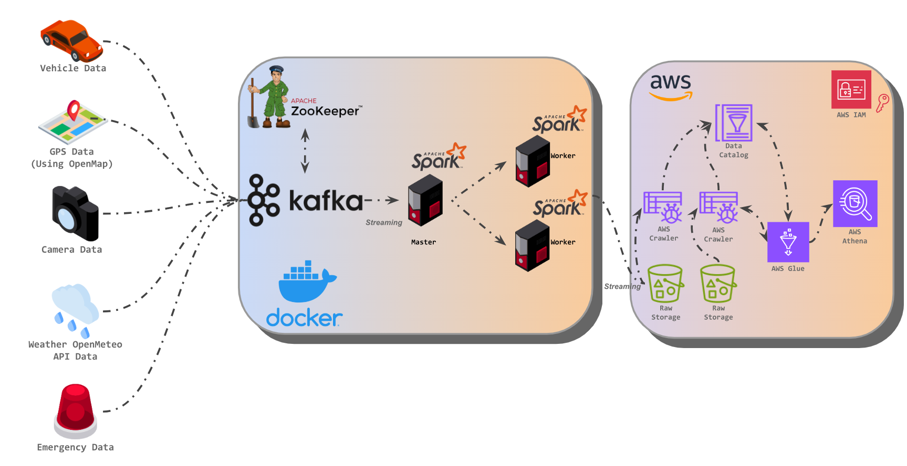

# Smart IoT Transport System - Real-Time Data streaming Pipeline

This project implements a real-time data processing pipeline for collecting, processing, and analyzing data from IoT devices installed in vehicles. The system is designed to monitor and analyze various parameters such as vehicle information, GPS location, weather conditions, camera feeds, and road incidents during a journey from Medina Square TLV to TLV Museum (IL).

## Table of Contents

- [Overview](#overview)
- [Architecture](#architecture)
- [Features](#features)
- [Technologies Used](#technologies-used)
- [Prerequisites](#prerequisites)
- [AWS Credentials and Constants](#aws-credentials-and-constants)
- [Set Up](#set-up)
- [Usage](#usage)
- [Project Structure](#project-structure)


## Overview

The system simulates data generation from various IoT sensors and processes this data in real-time to provide actionable insights. It leverages a combination of open-source and AWS services to ensure scalability, reliability, and efficiency.

## Architecture



## Features

* **Real-Time Data Collection:** Simulates and collects data from various IoT sensors in real-time.

* **Scalable Data Ingestion:** Utilizes Kafka for efficient and scalable data streaming.

* **Robust Data Processing:** Processes and transforms data using Apache Spark.

* **Secure and Durable Storage:** Stores processed data securely in AWS S3.

* **Automated Data Cataloging:** Uses AWS Glue for automated schema discovery and data cataloging.

* **Interactive Querying:** Enables interactive querying of data through AWS Athena.

* **Insightful Visualization:** Provides data visualization and analytics through Looker dashboards.

* **Containerized Deployment:** Employs Docker for easy deployment and environment consistency.

## Technologies Used
* Programming Languages:
    * Python
    * Bash

* Data Streaming and Processing:
    * Apache Kafka  
    * Apache Spark

* Cloud Services (AWS):
    * S3
    * Glue & Glue Crawler
    * Athena
    * IAM (Identity and Access Management)

* Containerization:
    * Docker

* Data Visualization:
    * Looker

## Prerequisites

Installed Software:

* Docker
* Python 3.10+
* Apache Kafka (Dockerized Kafka)
* Apache Spark
* AWS Account with necessary permissions for S3, Glue, Athena.
* Google Looker account


## AWS Credentials and Constants:

Update the configuration yaml files to your variables. 
```bash
jobs/
|-- configs/
|   |-- configuration.yaml
|   |-- logging_configuration.yaml
```

## Set Up

#### 1. Setup Docker Environment
Ensure Docker is installed and running on your system.
``` bash
# Build Docker Images and Start Docker Containers
docker compose up --build -d
```

### 2. Setup AWS Resources
* **S3 Bucket:**  Create an S3 bucket to store the processed data
* **Glue Crawler:** Configure a Glue crawler to crawl the S3 bucket and update the data catalog
* **Athena:** Set up Athena to query data from the data catalog
* **Looker:** Add data to Looker for visualization.

Every service should have a dedicated IAM role with its permissions. 

## Usage
### 1. Running the Kafka Producer
The Kafka producer simulates data generation from IoT devices and publishes it to the respective Kafka Topics.

Weather Data:
* Using OpenMeteo API, the producer requests the weather data for the current timestamp and location.

GPS data:
* This data is generated using the osmnx and networkx libraries. When the producer is starting, Drive Simulator is created, it does the following: 
    1. Creating a strongly connected graph from the start location to the destination from the OpenStreetMap(OSM). Ensuring the graph is strongly connected is crucial when simulating routes or analyzing networks, especially in the context of urban street networks for tasks like simulating a car's journey. A graph is considered strongly connected if there is a path between all pairs of vertices in the graph.
    2. Calculating the shortest route based on time of arrival, taking one-way streets into account using the networkx library
    3. The process Culminates in the real-time generation of route travel simulation data, calculated based on the random speed and update frequency, providing a dynamic and accurate representation of the vehicle's journey.

Vehicle Data: 
* Generates data about the vehicle that is driving with its current location on the route.

Traffic Data: 
* Generates data about the current location using traffic camera. This data is a simulation and will include the camera information and the encoded image.

Emergency Data:
* Generates data about incidents that might have happened and its current type and status.

```bash
python3 -m venv venv
source venv/bin/activate

# Install dependencies
pip install -r requirements.txt

# Run producer code
python3 jobs/main.py
```

### 2. Running the Apache Spark Consumer
The Apache Spark consumer plays a crucial role in our data processing and storage process. It listens to the Kafka topics, processes incoming data, and stores it in the S3 bucket.  You can stop the consumer once the vehicle reaches its destination and the simulation ends.

The Spark master and workers are containerized in Docker, so we will use the docker exec and spark-submit commands to run the consumer.

Spark master port: 7077

Spark workers port: 9090

mvn -> The Spark config variables can be found at mvnrepository. The variables used in this project can be found in the configuration file.
```bash
docker exec -it smarttransport-spark-master-1 bin/spark-submit --master spark://spark-master:<spark-master-port> --packages <mvn_spark_groupId>:<mvn_spark_artifactId>:<mvn_spark_version>,<mvn_hadoop_groupId>:<mvn_hadoop_artifactId>:<mvn_hadoop_version>,<mvn_java_groupId>:<mvn_java_artifactId>:<mvn_java_version> \
jobs/consumers_spark.py
```

The Spark Consumer will consume the data from the topics according to the schemas that are configured in spark_schemas.py

### 3. Running AWS Glue Crawler 
* Navigate to the AWS Glue console and start the configured crawler manually or set up a schedule for automatic crawling.
* Make sure to exclude the spark metadata files in the Exclude section

### 4. Querying the data with Athena
* Use the AWS Athena console to write and execute SQL queries on the processed data.

### 5. Visualizing Data with Looker
* Access the Looker dashboard to visualize and derive insights from the data queried in Athena. 

## Project Structure
```bash
smart_transport_DE_Project/
|-- docker-compose.yml
|-- Dockerfile
|-- requirement.txt
|-- README.md
|-- jobs/
|   |-- main.py
|   |-- simulate_drive.py
|   |-- consumers_spark.py
|   |-- spark_schemas.py
|   |-- weather_api.py
|-- configs/
|   |-- configuration.yaml
|   |-- logging_configuration.yaml
```
